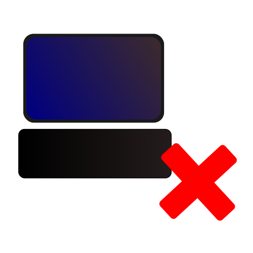

<div align=center>

<h1> 🚀 <b>App Uninstaller</b> – An easy to use program uninstaller for Linux</h1>


</div>

**App Uninstaller** is a sleek and intuitive application designed to make removing programs from your Linux system a breeze. Built with the power of **Rust** for speed and **GTK4** for a modern, user-friendly interface, this open-source tool provides an elegant solution to uninstalling software. Whether you're looking to clean up your system or simply remove an app you no longer need, Linux Uninstaller makes the process fast, easy, and hassle-free.

It's completely **free** and open-source, meaning you can contribute and customize it to your needs.

## ⚠️ Warning
This program is intended to clean up whatever your package manager won't. This is **not** a replacement for `apt`, `dnf` or `pacman`, or your respective package manager. In fact, combining the two might break your system. If you cannot get comfortable with the command line, I'd recommend finding a GUI frontend for your package manager, like `synaptic` for Debian, Ubuntu and Mint. In any case, this app targets *experienced* users who know what they are doing. Use responsibly!

## ✨ **Features**  

- 🌟 **Simplicity at its best:** A sleek and easy-to-navigate interface built with GTK4.
- 🚀 **Lightning-fast:** Built in Rust for speed and efficiency, ensuring smooth operation even on large systems.
- 🔓 **Open-source:** App Uninstaller is 100% open source and you can see exactly what every single button does.
- 💸 **100% free:** No hidden costs, no ads, just great software. You will never be asked to buy a premium version of this software.

## 📦 **Installation**  
Before installing, make sure you have installed Gtk4 (Should be available on almost all modern Linux platforms). Older systems (<2022) may not have it preinstalled.

### **Downloading** (Recommended for most users)
You can download the executable from [the latest release](https://github.com/tseli0s/AppUninstaller/releases/latest) (Look for the file called `LinuxAppUninstaller.bin`). Once you have downloaded the file, you can simply run it like you would a regular `.exe` file, either by double-clicking or calling it from the command line. There is no installation required, you simply download and use the app.

### **Build from source** (Recommended for developers and advanced users)
> *This assumes you have already installed the Rust toolchain. If not, head to https://rust-lang.org and follow the instructions there.*

Download the source either by cloning the repo or as a zip file. For example:
```sh
$ git clone https://github.com/tselios/AppUninstaller.git
```
Then, inside the source directory, run the following command to build the binary:
```sh
$ cargo b --release
```
When the command finishes, the executable will be placed under `<src>/target/release/LinuxAppUninstaller`. You can copy this file to one of the directories in your PATH environment variable (eg. `/usr/bin`). Alternatively, you can keep the binary at any folder you wish, but beware that it won't be accessible by the command line unless you specify the full path.

### **Install via Cargo** (Alternative)
If you have **Rust** and **Cargo** installed, you can easily install Linux Uninstaller directly from source. This may be faster for certain users:
```sh
cargo install --path .
```
If you have **Cargo** yet you don't want to download the source, you can also run this command to install it directly in **Cargo**'s path:
```sh
cargo install linux-app-uninstaller
```

## 💾 **Supported Platforms**:
App Uninstaller works officially with Linux. The way it works means that it is possibly usable in most BSD and other Unix-like platforms. macOS is not supported.

## 🖥️ How to Use
1. Launch the application from your terminal or application menu.
2. Browse the list of installed programs on the left or search for a specific one.
3. Select the program you want to uninstall, then click ***Delete application!*** on the right.

## 🤝 Contributing
We welcome contributions to make App Uninstaller even better! If you have ideas for improvements, bug fixes, or new features, feel free to open an issue or submit a pull request.

### **How to contribute:**
1. Fork the repository.
2. Clone your fork locally.
3. Create a branch for your feature or bug fix.
4. Commit your changes and push to your fork.
5. Open a pull request with a description of what you've changed.

## 📜 License

This project is licensed under the GNU GPL 3.0 License. See the LICENSE file for more information. Any contributions made to this project are assumed to be licensed under the same license as the project itself.